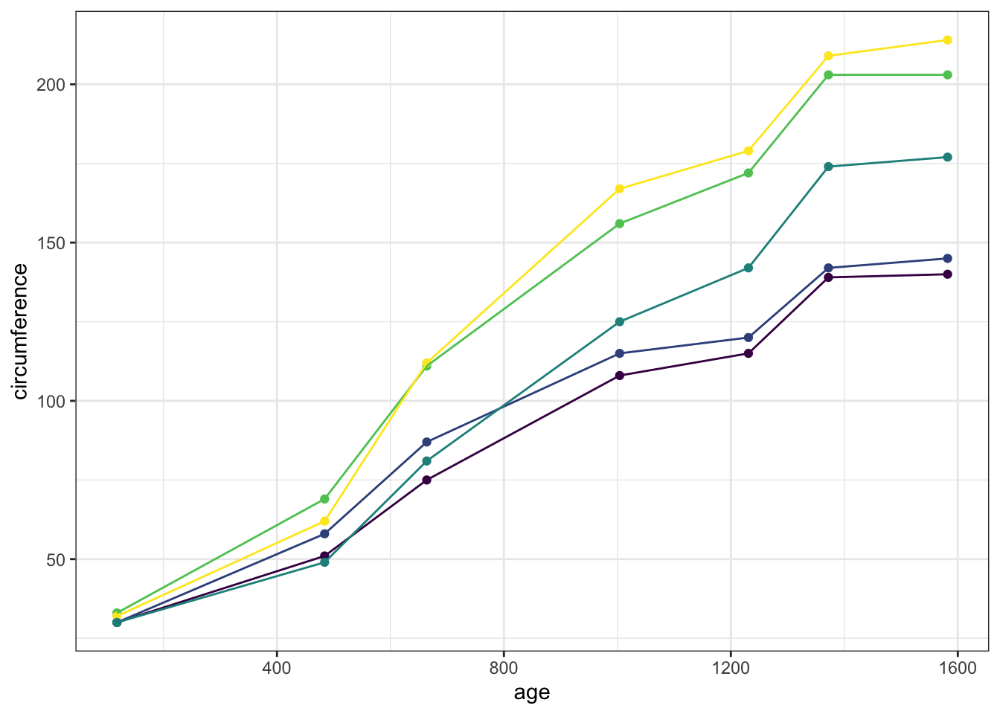

# New text!


```r
summary(Orange)
```

```
##  Tree       age         circumference  
##  3:7   Min.   : 118.0   Min.   : 30.0  
##  1:7   1st Qu.: 484.0   1st Qu.: 65.5  
##  5:7   Median :1004.0   Median :115.0  
##  2:7   Mean   : 922.1   Mean   :115.9  
##  4:7   3rd Qu.:1372.0   3rd Qu.:161.5  
##        Max.   :1582.0   Max.   :214.0
```

## Text for a new subsection

This is a very important subsection.


```r
library(ggplot2)
oplot <- ggplot(Orange, aes(x = age, 
                   y = circumference, 
                   colour = Tree)) +
  geom_point() +
  geom_line() +
  guides(colour = "none") +
  theme_bw()
oplot
```

<!-- -->
