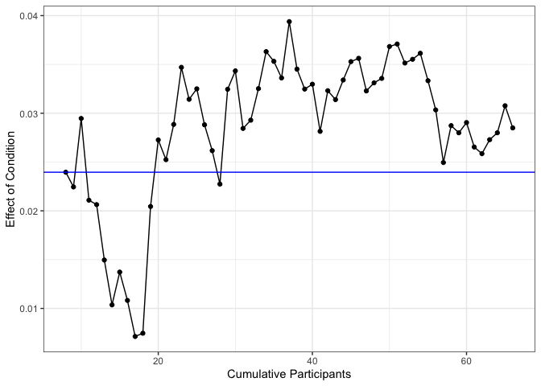
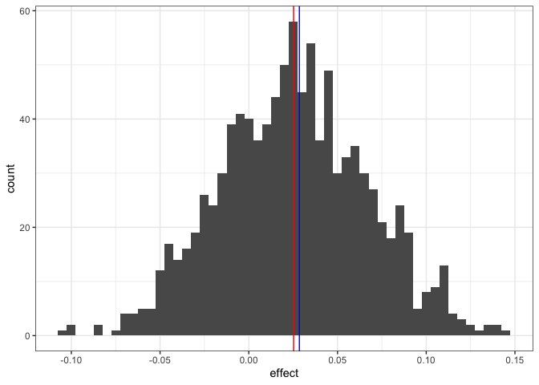
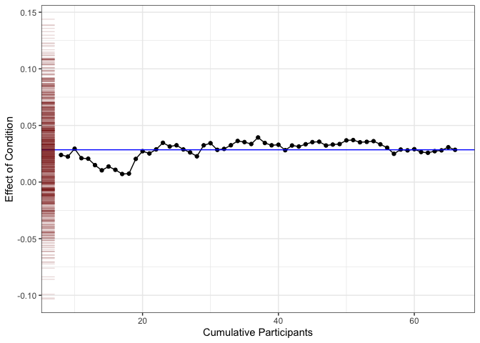
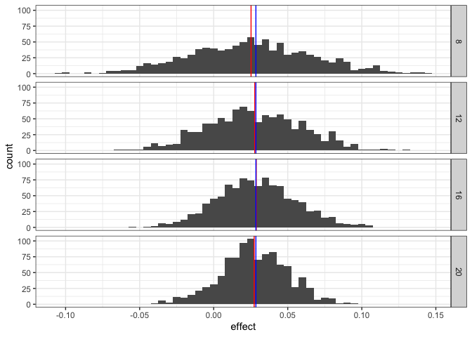

In my statistics class this Spring, we had a discussion about scientific reproducibility and practices that can lead to p-hacking. Two points came up in the class discussion that I have been interested to test on a real dataset. The first point is that p-values for a model can fluctuate quite dramatically with the addition of each new piece of data. Without an a priori defined sample size, this can lead researchers to collect a set of data, run an analysis, and then collect more data if the p-value is not significant. In the biz, this practice is widely considered p-hacking. The second point is that, in the absence of prior literature on an effect, researchers can collect data from a small pilot sample and then use the effect size from that sample as an estimate for the true effect size.  With that information, the researcher can conduct a power analysis to estimate the required sample size to detect a significant effect. Having a good estimate of the effect size allows researchers to conduct a power analysis and define a sample size before data collection and (ideally) protects against one type of p-hacking. 

These points generated some questions for me: 1) In my own wild caught data, how much will the p-value behave as sample size increases? If I analyzed my data with every new subject, is it possible that the p-value could alternate back and forth across the .05 threshold? 2) If the p-value is variable, could the effect size also be variable? And if the effect size is highly variable, using the effect size from a pilot sample might not be a very useful estimate for the true effect size.
  

```r
library(tidyverse)
library(lme4)
library(lmerTest)

path <- "content/post/2022-11-23-protecting-against-sketchy-research-practices-p-values-effect-sizes-and-power-analyses/data"

data <- read_csv(here::here(path, "data_clean.csv")) %>%
  mutate(ItemID = as_factor(ItemID),
         Condition = as_factor(Condition))
```

To answer the both questions, I wrote a function in R that runs a regression model on progressively larger and larger datasets. It begins with participants 1 through 8, then adds participants one at a time until the full dataset participants is included. The function saves the p-value and the effect size for each sample size.


```r
# Function to save p-values and effect sizes 
model.info.extractor <- function(dataset, filter.low, filter.high, model.formula) {
  
  n <- length(unique(dataset$SubjectID))
  Subs <- seq(from = 8, to = n, by = 1)
  data <- filter(dataset, logRT > log(filter.low), logRT < log(filter.high))
  
  # Initialize output
  output <- data.frame(Subs = vector("integer", length(Subs)), 
                       p.val = vector("double", length(Subs)), 
                       effect = vector("double", length(Subs)))
  
  for (i in 1:length(Subs)) {
    
    temp.data <- data %>%
      filter(SubjectID <= Subs[i])
    
    contrasts(temp.data$Condition) <- c(-1/2,1/2)
    model <- lmer(model.formula, data = temp.data)

    output$Subs[i] <- Subs[i]
    output$p.val[i] <- coef(summary(model))[,"Pr(>|t|)"]["Condition1"]
    output$effect[i] <- coef(summary(model))[,"Estimate"]["Condition1"]
  }
  return(output)
}
```

The first argument of the function is the dataset we want to extract p-values and effect sizes from. My data is made up of reaction times, and many of them are unrealistically short or long. So, I added arguments to the function that allow me to specify how I want to filter the reaction times. I also added an argument to specify the formula of the model I would like to test. 

## Just how variable are p-values?


```r
Change <- model.info.extractor(data, 150, 2000,
                                      logRT ~ Condition + logTrial + Duration
                                      + (1 + Condition + logTrial|SubjectID)
                                      + (1|ItemID))
write_csv(Change, "Change.csv")
```

The function takes quite a while to run, so I ran it once and then saved the results in .csv to save myself 10 minutes every time I wanted to run this document. The output of the function is read back in below.


```r
Change <- read.csv(here::here(path, "Change.csv"))
Change
```

```
##    sample      p.val      effect
## 1       8 0.64676225 0.023956551
## 2       9 0.66407860 0.022449371
## 3      10 0.53701072 0.029465728
## 4      11 0.64010673 0.021090871
## 5      12 0.62431914 0.020641288
## 6      13 0.71429794 0.014962941
## 7      14 0.78787040 0.010366001
## 8      15 0.70523232 0.013724233
## 9      16 0.75750242 0.010822900
## 10     17 0.83511818 0.007125767
## 11     18 0.81899813 0.007458847
## 12     19 0.53177486 0.020446333
## 13     20 0.39276307 0.027265608
## 14     21 0.41979771 0.025243074
## 15     22 0.35428068 0.028851680
## 16     23 0.25324610 0.034702771
## 17     24 0.28520421 0.031424818
## 18     25 0.25063186 0.032500367
## 19     26 0.30061596 0.028820287
## 20     27 0.32544118 0.026168487
## 21     28 0.37970644 0.022739126
## 22     29 0.20218179 0.032456029
## 23     30 0.16383456 0.034340176
## 24     31 0.24343635 0.028443160
## 25     32 0.22899481 0.029287060
## 26     33 0.17255466 0.032524906
## 27     34 0.12321259 0.036312403
## 28     35 0.12617932 0.035316236
## 29     36 0.13393238 0.033615814
## 30     37 0.08156411 0.039386283
## 31     38 0.12331565 0.034519362
## 32     39 0.13420377 0.032474447
## 33     40 0.12076917 0.032975589
## 34     41 0.18907464 0.028143834
## 35     42 0.12638608 0.032307440
## 36     43 0.13275847 0.031397508
## 37     44 0.10690998 0.033406869
## 38     45 0.08363454 0.035285994
## 39     46 0.07602317 0.035625700
## 40     47 0.09913246 0.032287522
## 41     48 0.08451991 0.033115017
## 42     49 0.08081721 0.033569783
## 43     50 0.05301991 0.036834747
## 44     51 0.04962206 0.037092784
## 45     52 0.05852353 0.035143302
## 46     53 0.05572218 0.035525510
## 47     54 0.04824258 0.036146644
## 48     55 0.06670433 0.033332983
## 49     56 0.09085026 0.030340820
## 50     57 0.16460932 0.024950534
## 51     58 0.10483742 0.028731731
## 52     59 0.11067395 0.027995704
## 53     60 0.09383258 0.029044598
## 54     61 0.12589841 0.026536518
## 55     62 0.13250701 0.025856093
## 56     63 0.10794631 0.027289401
## 57     64 0.09677430 0.028000392
## 58     65 0.06466498 0.030765681
## 59     66 0.08349184 0.028497436
```

After running the function above, I used ggplot to graph the p-values in order to answer my first question about how the p-value behaves over time. 


```r
ggplot(Change, aes(x = sample, y = p.val)) +
  geom_point() +
  geom_line() +
  geom_hline(yintercept = .05, color = "red") +
  xlab("Cumulative Participants") + ylab("p-value") +
  theme_bw()
```

<!-- -->

For the first 30 or so participants, the p-value fluctates a lot with each new participant but generally seems to decrease. After that, it looks like there is less fluctuation and no certain trend in one direction or another. Between participants 50 through 55, the p-value momentarily dips below the .05 threshold and, for a brief moment, I had sweet, sweet scientific glory in my grasp. It's easy to imagine that if I were collecting data without a pre-defined target sample size, I might have just stopped here and sent my paper off to Nature. Unfortunately for my CV, this did not happen :(
  
##Is the effect size from a small pilot sample a good estimate for the true effect size?

Given the variability of p-values as the sample size grows, let's see if the size of the effect is similarly variable over the course of a study. As mentioned earlier, it is common practice to use the effect from a small pilot sample to estimate a sample size using a power analysis. But if effect sizes are really variable, a power analysis might not yield a reliable sample size from a small sample. 

On one hand, if we underestimate the true effect, a power analysis would lead us to collecting a larger sample than necessary. While this is not necessarily bad, it can cause practical problems for projects that are costly or time-intensive. Alternatively, if we overestimate the true effect, a power analysis would lead us to collect a smaller sample than necessary. This would lead researchers not to detect effects when they actually do exist, which is definitely not good. 
  

```r
ggplot(Change, aes(x = sample, y = effect)) +
  geom_point() +
  geom_line() +
  geom_hline(yintercept = Change$effect[1], color = "blue") +
  xlab("Cumulative Participants") + ylab("Effect of Condition") +
  theme_bw()
```

<!-- -->

The blue line here represents the effect of 0.0239566 for subjects 1-8, which is the value that I would have used to estimate the true effect size had I done a power analysis. Just from inspecting the graph, it seems that the effect behaves similarly to the p-value in that it is volatile at first and then stabilizes. This makes sense given that the p-value is derived in part from the effect. The biggest difference from p-value variability is that it seems harder to argue that there is a clear directional trend. 

Notably, the effect size of 0.0239566 for subjects 1-8 is not very far off from the effect size of 0.0284974 for the whole sample of 66 subjects. In my case, I would have been lucky to use the effect for subjects 1-8. But the volatility of the effect size early on seems generally problematic for the strategy of using effect sizes from small samples as estimates of the true effect size. 

Presumably the order of my participants was random, so the early effect size volatility should be true no matter the order of the subjects. We can test this by randomly drawing a large number of hypothetical pilot participant groups from the dataset and seeing how often the effect is close to the one we observed above.


```r
effect.size.extractor <- function(dataset, sims, sample.size, model.formula) {
  
  n <- length(unique(dataset$SubjectID))
  
  # Initialize output
  output <- data.frame(SampleNum = vector("integer", sims), 
                       p.val = vector("double", sims), 
                       effect = vector("double", sims))
  
  for (i in 1:sims) {
    
    #Random Subset of Subjects
    data.filt <- dataset %>%
      ungroup() %>%
      select(SubjectID) %>%
      distinct() %>%
      #assign random number to each subject
      mutate(RandSub = sample(1:n, n, replace = F)) %>%
      right_join(data, by = "SubjectID") %>%
      #keep only random subjects 1-8
      filter(RandSub <= sample.size) %>%
      #apply desired filters
      filter(logRT > log(150), logRT < log(2000))
    
    #Run the Model
    contrasts(data.filt$Condition) <- c(-1/2,1/2)
    model <- lmer(model.formula, data = data.filt)

    #Store the output
    output$SampleNum[i] <- i
    output$p.val[i] <- coef(summary(model))[,"Pr(>|t|)"]["Condition1"]
    output$effect[i] <- coef(summary(model))[,"Estimate"]["Condition1"]
  }
  return(output)
}
```

The above function runs a for loop that takes random subsets of 8 from the sample of 66 subjects, fits a regression model to that subset, and then stores the p-value and effect coefficient from the model. Let's do this 1000 times and then look at the resulting distribution of effect sizes. For my sake, I'll run it on a model without `Duration` as a fixed effect to help the function run a bit more quickly. 


```r
resample8 <- effect.size.extractor(dataset = data, sims = 1000, sample.size = 8, model.formula = logRT ~ Condition + logTrial
                                  + (1 + Condition + logTrial|SubjectID) + (1|ItemID))
resample$n <- 8
write_csv(resample, "resample8.csv")
```


```r
resample8 <- read.csv(here::here(path, "resample8.csv"))
```

Similar to p-value function above, I saved the output to a .csv and then reloaded the file to save myself the time it takes for the function to run when knitting this document into the website. 


```r
ggplot(resample8, aes(x= effect)) +
  geom_histogram(binwidth = .005) +
  geom_vline(xintercept = mean(resample8$effect), color = "red") +
  geom_vline(xintercept = Change$effect[59], color = "blue") +
  theme_bw()
```

<!-- -->

The effects are centered around 0.0252309 (blue line) which is close to the actual effect of 0.0284974 from our full sample (red line). This is to be expected, as modelling a large number of small subsets effectively approximates one model with the full dataset. I expect with an infinite number of resamplings, these two would converge.  However, the effects do seem to vary considerably around this number. If I had collected my data from subjects in a different order, I could have estimated an effect size ranging from -.10 to nearly 0.15 in a pilot sample.

To visualize this pilot sample variation relative to how the effect sizes varied in the full dataset, I've added a rug plot of the resampled effect sizes to the y-axis of the line graph below. 


```r
ggplot(Change) +
  geom_point(aes(x = sample, y = effect)) +
  geom_line(aes(x = sample, y = effect)) +
  geom_hline(yintercept = Change$effect[59], color = "blue") +
  xlab("Cumulative Participants") + ylab("Effect of Condition") +
  geom_rug(data = resample8, aes(y = effect), col=rgb(.5,0,0,alpha=.15)) +
  theme_bw()
```

<!-- -->

With pilot sample of only 8 participants, there seems to be a great deal of variability around the effect size. Most effect sizes are clustered near the true effect size of 0.0284974 (blue line), though it would be plausible to estimate an effect size that's near zero or even negative. Obtaining an effect size near or less than zero would have a large influence on the results of a power analysis. This suggests to me that a pilot sample of this size might not be large enough. Let's see if the effect size estimates get more accurate with larger pilot samples. 


```r
resample12 <- effect.size.extractor(dataset = data, sims = 1000, sample.size = 12,
                                   model.formula = logRT ~ Condition + logTrial
                                   + (1 + Condition + logTrial|SubjectID) + (1|ItemID))
resample12$n <- 12
write_csv(resample12, "resample12.csv")

resample16 <- effect.size.extractor(dataset = data, sims = 1000, sample.size = 16,
                                   model.formula = logRT ~ Condition + logTrial
                                  + (1 + Condition + logTrial|SubjectID) + (1|ItemID))
resample16$n <- 16
write_csv(resample16, "resample16.csv")

resample20 <- effect.size.extractor(dataset = data, sims = 1000, sample.size = 20,
                                  model.formula = logRT ~ Condition + logTrial
                                  + (1 + Condition + logTrial|SubjectID) + (1|ItemID))
resample20$n <- 20
write_csv(resample20, "resample20.csv")
```

As before, I ran the `effect.size.extractor` and saved the output to .csv file.


```r
resample8 <- read_csv(here::here(path, "resample8.csv"))
resample12 <- read_csv(here::here(path, "resample12.csv"))
resample16 <- read_csv(here::here(path, "resample16.csv"))
resample20 <- read_csv(here::here(path, "resample20.csv"))

resample.all <- bind_rows(resample8, resample12, resample16, resample20) 

resample.all %>%
  group_by(n) %>%
  mutate(effect.mean = mean(effect)) %>%
ggplot(aes(x= effect, group  = n)) +
  geom_histogram(binwidth = .005) +
  geom_vline(aes(xintercept = effect.mean), color = "red") +
  geom_vline(xintercept = Change$effect[59], color = "blue") +
  facet_grid(n~.) +
  theme_bw()
```

<!-- -->

As expected, larger pilot samples do lead to more accuracy as evidenced by the narrower distributions in the larger samples. A larger pilot sample will always be more likely to provide a better estimate of the true effect size, but it's not clear exactly how large the pilot sample should be before it will provide an acceptable estimate.

##tl;dr

P-values seem to be quite variable over the course of data collection. This highlights the need for a good a priori sample size or data collection stopping rule that is independent of the p-value. Power analyses are a good way to come up with an a priori sample size. In the absence of a good estimate of effect size in the prior literature, we can use a small pilot sample to generate an estimate. The method of using a small pilot sample to estimate the true effect size might be necessary in some situations. In the absence of prior literature on an effect, a small pilot sample can be a useful estimate of effect size. If going with this approach, researchers should be careful to collect a pilot sample that is large enough to be a good ballpark estimator of the true effect size. 
  
####Unanswered Questions
1. In this dataset, the p-value dipped below .05 twice. If the participants had been collected in a different order, would this have happened? Or was there something systematic that led to this? 
2. Does similar p-value dipping happen on other datasets? Could I create simulated data with the same parameters and examine whether or not the p-value might behave similiarly? 
3a. How large does the pilot sample need to be before the effect size estimate is acceptable?
3b. In the dataset above, the effect size is very small. Does the size of the effect influence the accuracy of our effect size estimates? In other words, could we get away with a smaller pilot sample size when trying to make an estimate of a large effect size?


