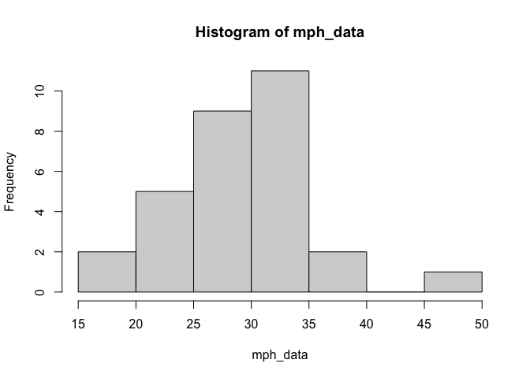
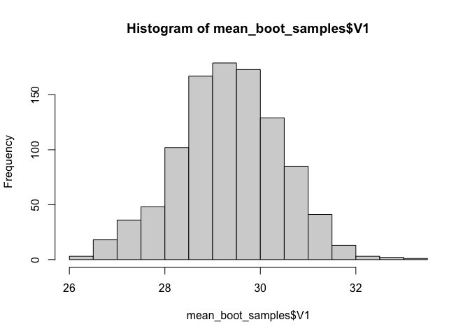
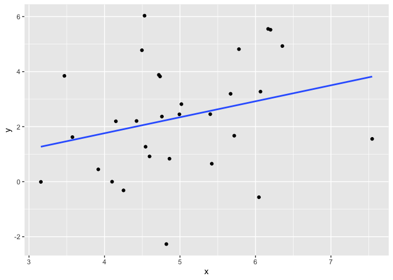
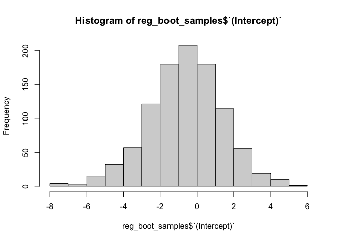
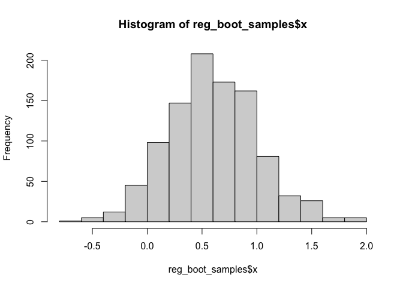

## Bootstrapping! Why is it useful?

I think bootstrapping is extremely cool for two reasons: it allows you to estimate error for any statistic you can imagine, and it does not make any assumptions about the distribution of the underlying data, in contrast to most test statistics. 

I have seen use cases for bootstrapping arise while fitting linear mixed effects models, mediation models, and also for more basic regression situations. However, you can compute a bootstrapped sampling distribution for any statistic literally anytime you have some set of data from which you want a statistic. 

The idea is that when we have collected a single set of data, we can compute a statistic from that data (say, a mean), but we don't have a sense of the reliability of that statistic. That is, how would the mean be different if we repeated data collection over and over again, many times? Bootstrapping allows us to simulate this process of repeated data collection by **resampling with replacement**. 

## How to bootstrap

Here's the whole bootstrapping algorithm:

1. Generate a new set of data using resampling with replacement. 
2. Compute your statistic of interest from that dataset.
3. Save that statistic of interest to a new dataframe.
4. Repeat steps 1-3 *m* times, where *m* is some arbitrarily large number (maybe 1,000 to 10,000).
5. Now that you have a distribution of *m* resamples, you can compute the mean, SD, and confidence intervals on this distribution.

You can use this distribution to ask questions like: What is the range of possible values for my statistic? Is the true value of my statistic different from zero?

## Simple bootstrap demo 

We'll start by making some fake data. Let's say this data represents measurements of the speed of cars outside your house. The speed limit is 25 miles per hour, but you want to know if drivers on the street drive faster than that on average. So, you go outside and you measure the speed of 30 different cars, and this data is the result.


```r
set.seed(35)
mph_data <- rnorm(n = 30, mean = 27, sd = 6)

hist(mph_data)
```

<!-- -->

Just eyeballing the data, yes it looks like people do tend to drive faster than the speed limit! The mean of our dataset is 29.3233613, which is certainly over the speed limit. And looking at the distribution, most people appear to be driving over as well, with at least one person doing almost 50 mph. But there are also a number of people driving below the speed limit. We might want to ask then, how sure are that the average driver is going above 25 mph? After all, we only sampled from 30 different vehicles, we haven't assessed the speed of every single car that drives down this street. 

The bootstrap can help to answer this! It's pretty easy to write up your own bootstrapping code, but we'll use the `boot` package because it has some additional functions which I think are helpful.


```r
library(boot)
library(tidyverse)
```

Per the documentation for the `boot()` function, we need to first create a custom function that takes two arguments: the original data and an index vector (a vector of numbers). The index vector will be used to create our resampled datasets. The output of this function is the statistic computed on resampled data. 


```r
our_boot_fun <- function(data, index) {

  data_resampled<- data[index]  #creates a new vector, which is a version of the original vector that is resampled with replacement
  
  sample_mean <- mean(data_resampled) #compute the statistic of interest
  
  return(sample_mean) 
}
```

We can actually run this function by hand to get a sense for how bootstrapping works. It's also a bit of sanity check to make sure the function works. We first need to create vectors which correspond to resampled dataframes. Below, I've created sample1, sample2, and sample3. Each number in each sample corresponds to a single resampled with replacement. So, for sample 1, we can see that row 1, 4, 6 (and others) are sampled twice, while row 14, 19-22, 24, and (and others) are not sampled at all. And There is a similar story for sample 2—here it looks like row 19 is actually sample four separate times. 


```r
set.seed(123)
n <- length(mph_data)
sample1 <- sample(1:n, size = n, replace = T)
sample2 <- sample(1:n, size = n, replace = T)

sort(sample1)
```

```
##  [1]  3  3  5  5  7  8  9  9 10 10 11 14 14 15 18 19 19 20 22 22 25 25 25 26 26
## [26] 27 27 28 29 30
```

```r
sort(sample2)
```

```
##  [1]  2  4  5  6  7  7  7  8  9  9 10 10 11 12 12 13 13 14 15 17 19 21 21 21 23
## [26] 25 27 27 28 29
```

Since we have two different sample vectors, let's see if using these different sample vectors results in different mean estimate when we pass those vectors to the `our_boot_fun()` function. If our function works, we should get different estimates, because by resampling with replacement we've perturbed our sample just a bit!


```r
test_boot <- bind_rows(
  boot1 = our_boot_fun(data = mph_data, index = sample1),
  boot2 = our_boot_fun(data = mph_data, index = sample2),
)

test_boot
```

```
## # A tibble: 1 × 2
##   boot1 boot2
##   <dbl> <dbl>
## 1  30.3  29.4
```

Looks good! We have slightly different estimates of the means. After running this function a large number of times, the distribution of these means corresponds to the sampling distribution of each statistic (i.e. what would happen if we randomly took measurements of the cars outside the house a large number of times).

We could bootstrap by hand by generating 1000 unique samples ourselves, but the boot package just makes the bookkeeping a bit easier for us by generating as many new samples as we tell it to, and then packaging up the results of all of these resamples. Note that it creates an object of the class "boot".


```r
mean_booted <- boot(data = mph_data, statistic = our_boot_fun, R = 1000)
class(mean_booted)
```

```
## [1] "boot"
```

We can get a nice summary of these distributions:


```r
broom::tidy(mean_booted)
```

```
## # A tibble: 1 × 3
##   statistic   bias std.error
##       <dbl>  <dbl>     <dbl>
## 1      29.3 0.0235      1.09
```

Or visualize the sampling distribution independently by extracting the bootstrapped samples from the "boot" object.


```r
mean_boot_samples <- as.data.frame(mean_booted[["t"]])
head(mean_boot_samples, n  = 10)
```

```
##          V1
## 1  26.92111
## 2  27.75608
## 3  29.21445
## 4  27.88146
## 5  27.01803
## 6  27.45576
## 7  29.20642
## 8  29.66988
## 9  29.19769
## 10 30.50139
```

```r
hist(mean_boot_samples$V1)
```

<!-- -->

The sampling distribution is very clearly above 25! But let's get confidence intervals just to be sure.

We can easily do that using the `boot.ci()` function. We need to give the function an object of class "boot", which we created above, an index corresponding to the parameter we want CI for, and the method of calculated the CI. I recommend just using "bca" for now, as it corrects for the slight difference between the mean of the sampling distribution and the mean of our observed data.


```r
mean_ci <- boot.ci(mean_booted, index = 1, type = "bca") #confidence interval on intercept
mean_ci
```

```
## BOOTSTRAP CONFIDENCE INTERVAL CALCULATIONS
## Based on 1000 bootstrap replicates
## 
## CALL : 
## boot.ci(boot.out = mean_booted, type = "bca", index = 1)
## 
## Intervals : 
## Level       BCa          
## 95%   (27.02, 31.33 )  
## Calculations and Intervals on Original Scale
```

So the 95% CI is [27.02, 31.33], which clearly does not contain 25 mph. It looks like we can be pretty confident the average driver on our street is going above the speed limit! 

## More complex example

Bootstrapping is an extremely general method, there's no need to limit ourselves to simple univariate situations like above. We can also compute bootstrapped statistics for regression parameter estimates (or really any statistic from a regression model!)

Let's generate some fake data again:


```r
n <- 30
set.seed(34)
reg_data <- tibble(
  x = rnorm(n = n, mean = 5, sd = 1),
  y = rnorm(n = n, mean = x/2, sd = 2)
)

ggplot(reg_data, aes(x, y)) +
  geom_point() +
  geom_smooth(method = "lm", se = F)
```

```
## `geom_smooth()` using formula 'y ~ x'
```

<!-- -->

There appears to be positive relationship between `x` and `y`, but lets build a regression model to see this.


```r
mod <- lm(y ~ x, data = reg_data)
summary(mod)
```

```
## 
## Call:
## lm(formula = y ~ x, data = reg_data)
## 
## Residuals:
##     Min      1Q  Median      3Q     Max 
## -4.5050 -1.2755  0.1384  1.6858  3.9646 
## 
## Coefficients:
##             Estimate Std. Error t value Pr(>|t|)
## (Intercept)  -0.5621     1.9399  -0.290    0.774
## x             0.5806     0.3822   1.519    0.140
## 
## Residual standard error: 2.013 on 28 degrees of freedom
## Multiple R-squared:  0.07614,	Adjusted R-squared:  0.04314 
## F-statistic: 2.308 on 1 and 28 DF,  p-value: 0.14
```

There does appear to be a positive relationship, but it's not significant. Let's create a bootstrap function to get a sampling distribution on this relationship to see if we can get an idea of the plausible values for this relationship.

To do this, we need to only make a small modification of our custom function we defined above.


```r
new_boot_fun <- function(data, index) {

  data_resampled <- data[index,]  #creates a new dataframe, which is a version of the original vector that is resampled with replacement
  
  mod_resampled <- lm(y ~ x, data = data_resampled) #fit the model
  
  coefs <- coef(mod_resampled) #extract the statistic of interest
  
  return(coefs) 
}
```

The biggest change is that we've added a regression model to the function. This model is fit using the resampled data, and then we extract the coefficient estimates from that model using `coef()`, in this case this is just the intercept and slope.


```r
reg_booted <- boot(reg_data, new_boot_fun, R = 1000)
```

We can now get a nice summary of the output:


```r
broom::tidy(reg_booted)
```

```
## # A tibble: 2 × 4
##   term        statistic    bias std.error
##   <chr>           <dbl>   <dbl>     <dbl>
## 1 (Intercept)    -0.562 -0.0811     1.99 
## 2 x               0.581  0.0184     0.402
```

And look at the sampling distribution for each:


```r
reg_boot_samples <- as.data.frame(reg_booted[["t"]])
colnames(reg_boot_samples) <- c("(Intercept)", "x")

hist(reg_boot_samples$`(Intercept)`)
```

<!-- -->

```r
hist(reg_boot_samples$x)
```

<!-- -->

And compute 95% CIs:


```r
reg_ci_int <- boot.ci(reg_booted, index = 1, type = "bca")
reg_ci_slope <- boot.ci(reg_booted, index = 2, type = "bca")

reg_ci_int
```

```
## BOOTSTRAP CONFIDENCE INTERVAL CALCULATIONS
## Based on 1000 bootstrap replicates
## 
## CALL : 
## boot.ci(boot.out = reg_booted, type = "bca", index = 1)
## 
## Intervals : 
## Level       BCa          
## 95%   (-4.5737,  3.3697 )  
## Calculations and Intervals on Original Scale
```

```r
reg_ci_slope
```

```
## BOOTSTRAP CONFIDENCE INTERVAL CALCULATIONS
## Based on 1000 bootstrap replicates
## 
## CALL : 
## boot.ci(boot.out = reg_booted, type = "bca", index = 2)
## 
## Intervals : 
## Level       BCa          
## 95%   (-0.2291,  1.4225 )  
## Calculations and Intervals on Original Scale
```

We now have 95% CIs for both the intercept and parameter. Notably, the range for the intercept is relatively large (going from negative to positive), which makes sense given our data. The range for the slope is [-0.23,1.42], which is consistent with our model output. The relationship between x and y could be slightly negative, or it could be almost 1.5. 


## Final notes

As I mentioned earlier, bootstrapping is an extremely general procedure. It can be used to simulate the sampling distribution of any statistic you might need. This method generalizes to mixed effects or multilevel data as well, with the caveat that the multilevel structure of the data needs to be accounted for. The `lme4::bootMer()` provides one way to extend this to mixed effects models, and the usage is extremely similar to that of the `boot::boot()` function.

