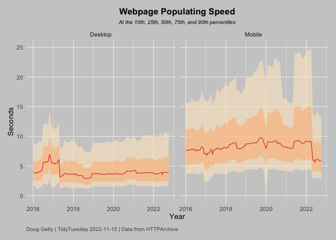

## Webpage Performance Metrics

This weeks [Tidy Tuesday](https://github.com/rfordatascience/tidytuesday/tree/master/data/2022/2022-11-15) had data on several different metrics of webpage performance. I only chose to do the webpage populating speed, and break it up by desktop vs. mobile.


```r
library(tidyverse)

df_speed_index <- readr::read_csv('https://raw.githubusercontent.com/rfordatascience/tidytuesday/master/data/2022/2022-11-15/speed_index.csv', col_types = cols(
  date = col_date(format = "%Y_%m_%d")
))
```

Let's peek at the data: 


```r
glimpse(df_speed_index)
```

```
## Rows: 238
## Columns: 9
## $ measure   <chr> "speedIndex", "speedIndex", "speedIndex", "speedIndex", "spe…
## $ client    <chr> "desktop", "mobile", "desktop", "mobile", "desktop", "mobile…
## $ date      <date> 2022-10-01, 2022-10-01, 2022-09-01, 2022-09-01, 2022-08-01,…
## $ p10       <dbl> 1.59, 2.92, 1.61, 2.92, 1.62, 2.98, 1.65, 3.00, 1.57, 2.90, …
## $ p25       <dbl> 2.42, 4.03, 2.45, 4.04, 2.48, 4.16, 2.50, 4.17, 2.30, 3.95, …
## $ p50       <dbl> 3.88, 5.87, 3.91, 5.88, 3.96, 6.12, 3.97, 6.11, 3.53, 5.63, …
## $ p75       <dbl> 6.45, 8.85, 6.50, 8.86, 6.56, 9.37, 6.56, 9.32, 5.62, 8.37, …
## $ p90       <dbl> 10.52, 13.32, 10.57, 13.33, 10.65, 14.18, 10.64, 14.05, 9.00…
## $ timestamp <dbl> 1.664582e+12, 1.664582e+12, 1.661990e+12, 1.661990e+12, 1.65…
```

There is a data column with speeds each month since 2016, a client column indicating desktop or mobile, and columns indicating the populating speed at various percentiles.


```r
colors <- c("#FEE8C8", "#FDBB84", "#E34A33")

df_speed_index %>% 
  mutate(client = ifelse(client == "desktop", "Desktop","Mobile")) %>% 
  ggplot(aes(x = date, group = client)) +
  geom_ribbon(aes(ymin = p10, ymax = p90), fill = colors[1], alpha = .6) +
  geom_ribbon(aes(ymin = p25, ymax = p75), fill = colors[2], alpha = .6) +
  geom_line(aes(y = p50), color = colors[3]) +
  facet_grid(.~client) +
  theme_minimal() +
  scale_y_continuous(minor_breaks = NULL) +
  ylab("Seconds") +
  xlab("Year") +
  labs(title = "Webpage Populating Speed", 
       subtitle = "At the 10th, 25th, 50th, 75th, and 90th percentiles",
       caption = "Doug Getty | TidyTuesday 2022-11-15 | Data from HTTPArchive") +
  theme(plot.caption = element_text(hjust = 0, colour = "gray30", size = 8, margin = margin(t = 10)),
        plot.margin = margin(12, 12, 12, 12),
        plot.title = element_text(hjust = .5, face = "bold"),
        plot.subtitle = element_text(hjust = .5, face = "italic", size = 8),
        plot.background = element_rect(colour = "gray80", fill = "gray80"),
)
```

<!-- -->

Interesting to see that mobile has always been slower, but it also notably has a huge right tail, such that the populating speed was almost 25 seconds for the 90th percentile in 2021 and 2022. Mobile also seems to have gotten a bit faster recently. 


