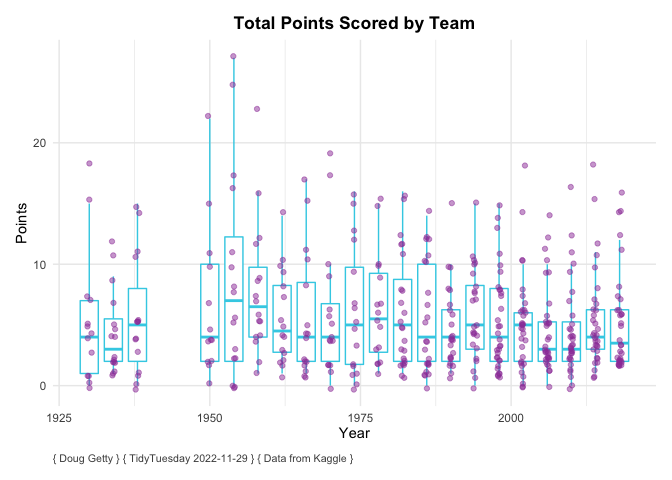
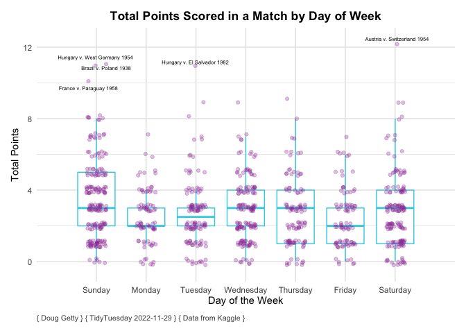

## FIFA World Cup

The Tidy Tuesday data comes this week from [Kaggle](https://www.kaggle.com/datasets/evangower/fifa-world-cup). More info about the Tidy Tuesday dataset can be found at the [Tidy Tuesday Github](https://github.com/rfordatascience/tidytuesday/tree/master/data/2022/2022-11-29)

This dataset has information on teams, scores, dates, and days of the week for every World Cup match ever played. There are lots of interesting questions that could be asked about this dataset (I'd love to build a prediction model at some point...), but I'll just visualize points scored in a couple of different ways.

First I'll load in the data


```r
library(tidyverse)


dat <- tidytuesdayR::tt_load('2022-11-29')
```

```
## 
## 	Downloading file 1 of 2: `wcmatches.csv`
## 	Downloading file 2 of 2: `worldcups.csv`
```

```r
df_match <- dat$wcmatches
```


## How many points have been scored each year? 

First, I created a figure showing the number of points scored by each team each year. The boxplots give a sense of the overall distribution, and the purple points are the team level totals. 


```r
bind_rows(
  select(df_match, year, team = home_team, score = home_score, winning_team), 
  select(df_match, year, team = away_team, score = away_score, winning_team)
) %>% 
  group_by(year, team) %>% 
  summarise(total_points = sum(score)) %>%
  ggplot(aes(x = year, y = total_points, group =  year)) +
  geom_boxplot(color = "#3CD0E6", outlier.alpha = 0, notchwidth = .75, width = 3) +
  geom_jitter(width = .4, alpha = .5, color = "#9d42a6") +
  theme_minimal() +
  scale_y_continuous(minor_breaks = NULL) +
  ylab("Points") +
  xlab("Year") +
  labs(title = "Total Points Scored by Team",
       caption = "{ Doug Getty } { TidyTuesday 2022-11-29 } { Data from Kaggle }") +
  theme(plot.caption = element_text(hjust = 0, colour = "gray30", size = 8, margin = margin(t = 10)),
        plot.margin = margin(12, 12, 12, 12),
        plot.title = element_text(hjust = .5, face = "bold"),
        plot.subtitle = element_text(hjust = .5, face = "italic", size = 8),
        line = element_line(color = "#ffc880")
)
```

<!-- -->

Interesting to see that a few teams were particularly high-scoring in 1954. Also seems that the spread of total points appears to be getting narrower year over year. 

## Are some days of the week more high-scoring than others?

Next I created a figure looking at whether some days of the week are more high scoring than others. Maybe, for example, weekends are more high-scoring than weekdays. Here, the purple points reflect game-level totals I've also labelled the most extreme points with their match lineups and years.


```r
set.seed(12345)

df_match %>% 
  mutate(match_points = home_score + away_score,
         dayofweek = as_factor(dayofweek)) %>% 
  group_by(dayofweek, year, stage, winning_team, losing_team) %>% 
  summarise(total_points = sum(match_points)) %>% 
  mutate(dayofweek = fct_relevel(dayofweek, "Sunday", "Monday", "Tuesday", "Wednesday", "Thursday", "Friday", "Saturday"), 
         year_lab = ifelse(total_points >= 10, str_c(winning_team, "v.", losing_team, year,sep = " "), ""),
         lab_point = total_points + runif(n(), min = -.5, max = .5)) %>% 
  ggplot(aes(x = dayofweek, y = total_points)) +
  geom_boxplot(color = "#3CD0E6", outlier.alpha = 0, notchwidth = .75) +
  geom_jitter( alpha = .3, color = "#9d42a6", position = position_jitter(width = .2, height = 0.2, seed = 321)) +
  geom_text(aes(label = year_lab, y = lab_point), size = 2, position = position_jitter(width = .2, seed = 321)) +
  scale_x_discrete(expand = c(.2,0)) +
  theme_minimal() +
  ylab("Total Points") +
  xlab("Day of the Week") +
  labs(title = "Total Points Scored in a Match by Day of Week",
       caption = "{ Doug Getty } { TidyTuesday 2022-11-29 } { Data from Kaggle }") +
  theme(plot.caption = element_text(hjust = 0, colour = "gray30", size = 8, margin = margin(t = 10)),
        plot.margin = margin(12, 12, 12, 12),
        plot.title = element_text(hjust = .5, face = "bold"),
        plot.subtitle = element_text(hjust = .5, face = "italic", size = 8),
        panel.grid = element_line(color = "gray90")
)
```

<!-- -->

Not too many clear patterns here, but a couple notable things: No match in the World Cup has ever had more than 12 points scored. From the labels, it seems clear that the most high scoring games are all distant history. There must have been some rule change or some factor that can account for the fact that the highest scoring games are all pre-1960 (with the exception of Hungary vs. El Salvador 1982)


